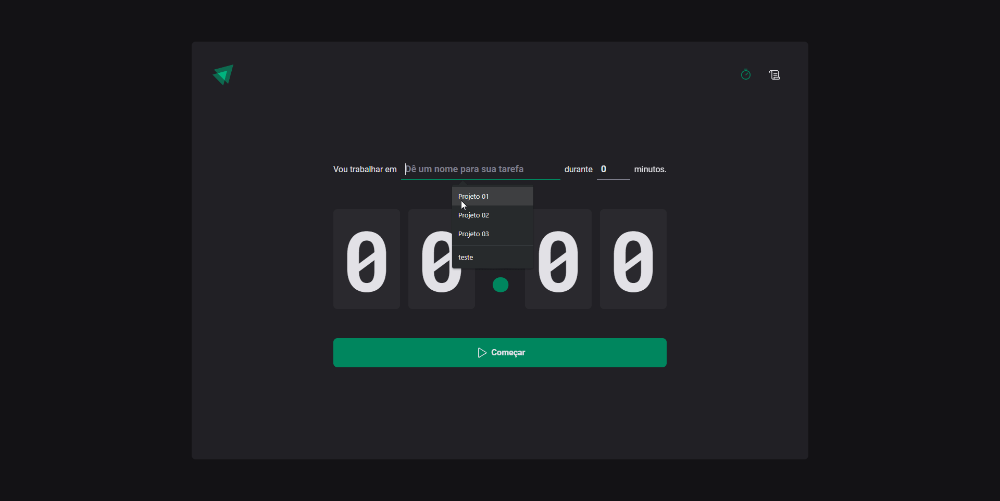

# ReactJS - IgniteTimer 

ℹ This project was developed during @rocketseat "Ignite | React JS" trail 💜

### ⚡ Main technologies used
    
- [ReactJS](https://react.dev/)
- [TypeScript](https://www.typescriptlang.org/)
- [Styled-components](https://styled-components.com/)
- [Immer](https://immerjs.github.io/immer/)
- [React-router-dom](https://reactrouter.com/en/main)
- [Zod](https://zod.dev/)

### 📌 Preview: 



### 🚀 Starting

_These instructions will allow you to get a working copy of the project on your local machine for development and testing purposes._

```
git clone https://github.com/joaopelisson/ReactJS_IgniteTimer.git
```

_After cloning run the command:_
```
npm install
```

_To start the development server:_
```
npm run dev
```